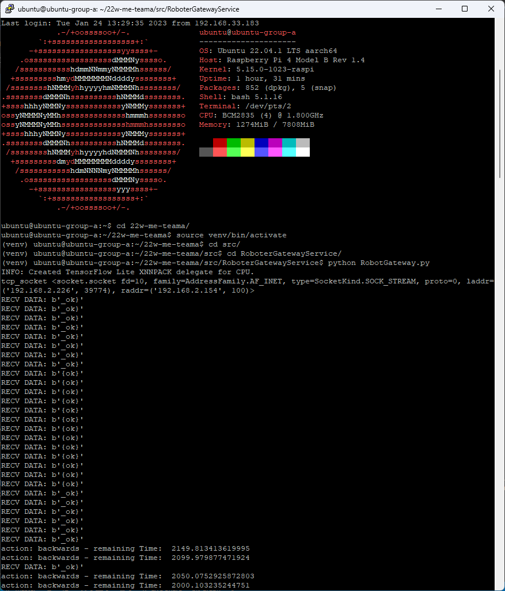

As our Project does not have any GUI I recommend to straight go to the `video` folder.
This folder contains videos showing each Scenario our Scenario is possible to do.

Nevertheless here is a screenshot of a Terminal on the Raspberry Pi 4 running the RobotGateway, which receives the commands from all the different input methods and mediates those to the Robot.

